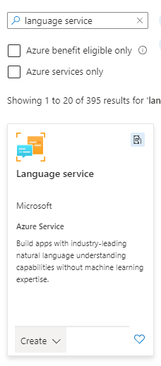
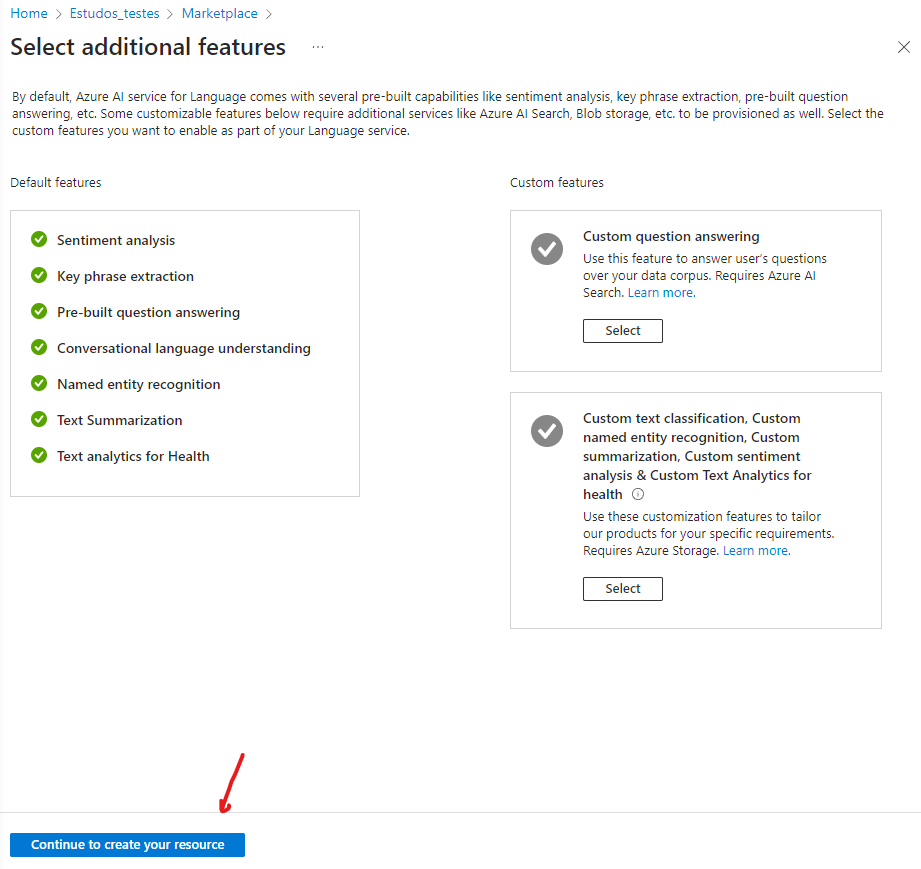
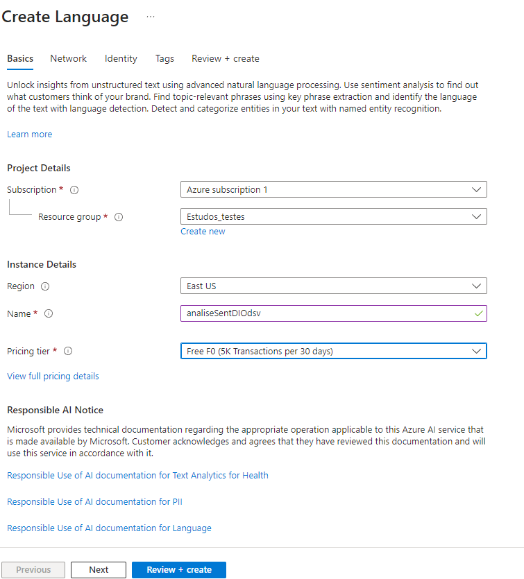
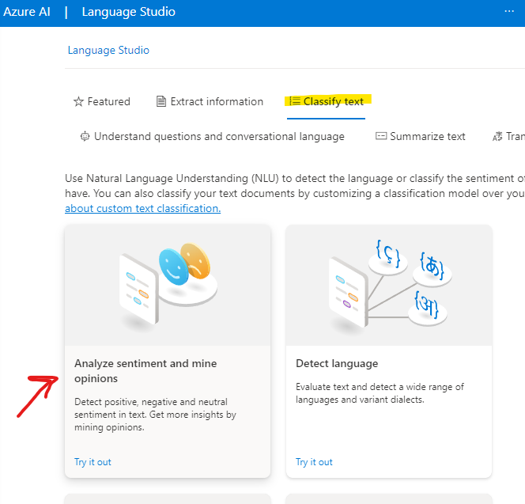
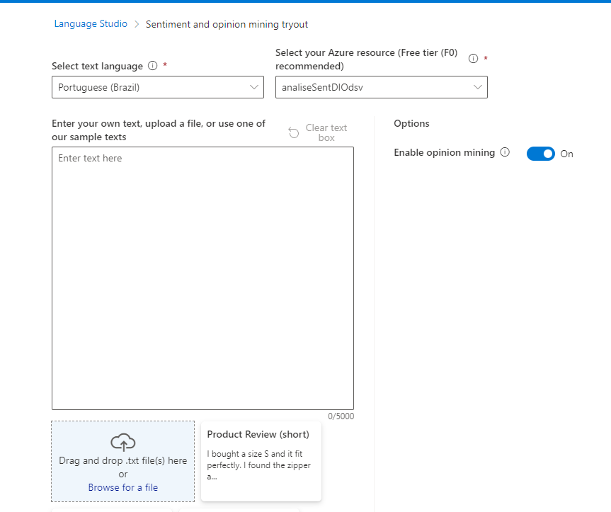
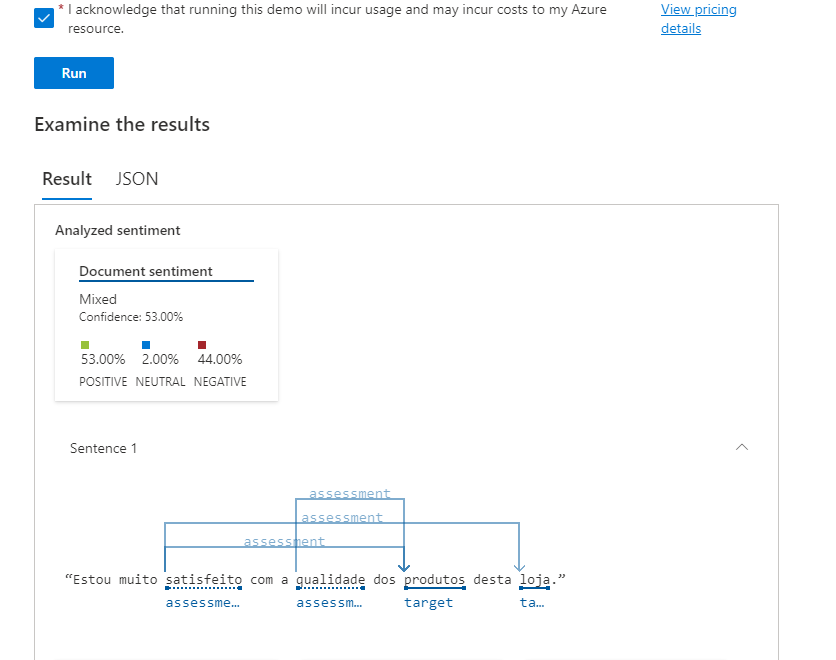
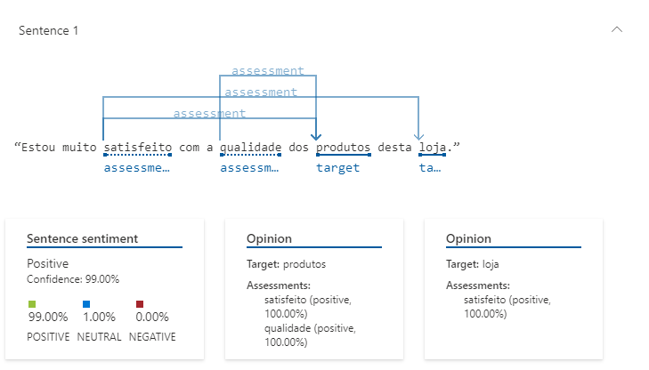

** Primeiro passo - Criar o Recurso: **
Dentro do https://portal.azure.com/ iremos criar o novo recurso (figura 1.0):

Na tela seguinte basta clicar em "Continue to create your resource":

Na próxima tela de configuração basta preencher os dados conforme necessidade e clicar em "Review + Create":

** Utilizando o Recurso: **
Após clicar em criar, a Azure fará o deploy do recurso, o que pode levar alguns minutos. Assim que o deploy acabar pode-se acessar o recurso pelo site https://language.cognitive.azure.com/ e fazer o login.

No portal, preencha as informações adicionais solicitadas e após, selecione a aba "Classify text" e em seguida no box "Analyze sentiment and mine opinions" clique em "try it out" como demonstrado na imagem abaixo:

Na próxima tela, selecione o idioma do texto em que se deseja analisar e o digite ou faça upload do arquivo no canto inferior esquerdo, como mostrado na imagem abaixo:

No meu caso, farei o upload do arquivo que se encontra na pasta Input neste repositório.

Após selecionar o arquivo .txt ou digitar um texto no box, desça a página, selecione o box marcado na imagem abaixo, clique em RUN. Depois analise os resultados:

Abaixo podemos ver qual foi a análise de sentimento da primeira frase que está presente no nosso input:

Podemos considerar que a análise está correta com relação a frase.

Inputs:
Esse recurso pode ser utilizado para:
Melhorar o Atendimento ao Cliente: Ao analisar os sentimentos expressos nas avaliações dos clientes, a loja pode identificar áreas onde o atendimento ao cliente pode ser melhorado.

Desenvolver Produtos e Serviços: A análise de sentimentos pode ajudar a identificar o que os clientes gostam ou não gostam em produtos ou serviços específicos, permitindo que a loja faça ajustes de acordo.

Gerenciamento de Reputação: A análise de sentimentos pode ajudar a loja a monitorar a percepção da marca pelos clientes e a responder a quaisquer problemas de reputação de maneira oportuna.

Segmentação de Clientes: Com base nos sentimentos expressos pelos clientes, a loja pode segmentar seus clientes em diferentes grupos para marketing e vendas direcionados.

Previsão de Vendas: Ao analisar os sentimentos dos clientes ao longo do tempo, a loja pode prever tendências de vendas futuras.